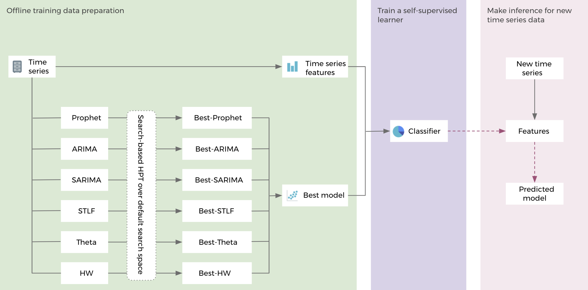
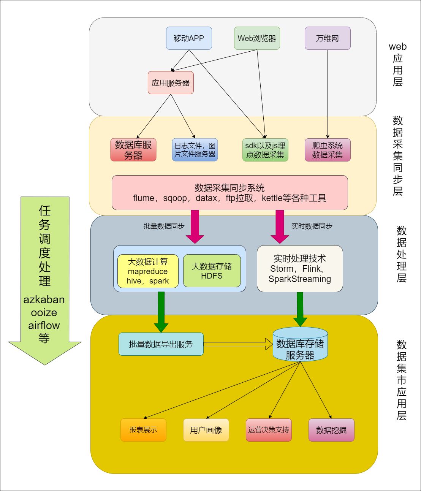
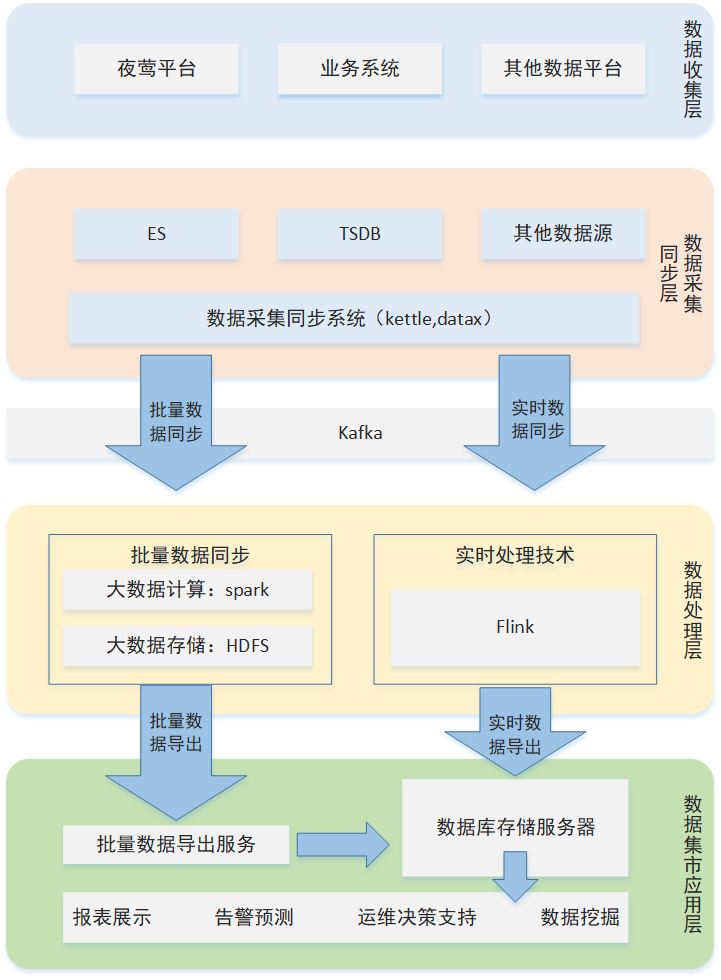

# Self-supervised-learning-frame
It is a Self-supervised learning frame interpret and some notes.

## Background
由于最近着手的项目需要设计一套预测平台的系统架构，故在此记录一些心得还有设想

## Part 1 超参数调优的自监督学习框架

参考了facebook人工智能实验室的Large-scale forecasting: Self-supervised learning framework for hyperparameter tuning一文中的自监督学习框架

Workflow of Self-Supervised Learning for Hyper-Parameter Tuning (SSL-HPT)

>在运维系统中，由于业务场景较为单一，相对环境干涉因素影响较小，大部分数值异常波动源于人为操作，在一期项目中预计采用Prophet及LSTM和ARIMA作为Time Series数据流处理算法，通过基于HPT（Hyper-parameter tuning超参数调试）在默认搜索空间内对各个处理算法结果进行最优选取。  
>在各预测算法结果被最优选择后，进行聚合横向对比分析，根据具体外部环境（集群性能、数据规模与预测区间等）筛选出最优模型。  
>在模型建立之后，将Time Series选出一部分特征作为输入项训练出自监督学习模型，根据分类器给出的特征加入至模型，对后续输入的New Time Series进行预测模型计算。

### 难点
1. 目前只做了Prophet并且还需要时间调参。
2. LSTM在三项算法中属于“上限高下限低”，该算法灵活度的更高，但相对的超参数设置也较为复杂，要计算出理想模型可能需要花费大量时间调参。
3. ARIMA还未涉及，通过算法介绍猜测上手难度为：Prophet < ARIMA < LSTM，ARIMA可能需要15-30天上手，目前算法实现优先级为Prophet > LSTM > ARIMA，根据项目进度及剩余时间调整建模调参时间
4. “最优模型”的筛选条件，目前而言在机器学习领域，对于一些性能相近的算法并无明确的优劣判别标准，仅能通过在同数据规模下时间及空间复杂度，模型测试生成的P-R图、正例概率代价等方面去对比，但是各个衡量标准数据区间及权重可能存在设置不合理，需要反复尝试才能迭代出较为科学的筛选方案。
5. 自监督学习模型的建立，目前还无自监督学习方面的知识储备，需要进一步学习。

待补充

## Part 2 大数据架构选型 Lambda

### Background
无论是自下而上还是自上而下，作为一名工程师考虑方案如何落地都是第一位的，在预测平台的算法及时序数据工作流框架基本确认后，抛出了第二个小阶段的核心问题，如何通过现有的大数据套件将方案落地并且符合企业级项目的要求。

### Lambda架构基本介绍

通过了解学习过常用大数据架构，如流式架构、Lambda架构以及Kappa架构 ，结合目前公司现有项目结构，在运维监控领域，大部分数据实时性要求不强，但是另一方面小部分数据的实时性及敏感度要求较高，如果采用
流式架构，不存在预处理数据，在传统运维领域是较为适用的，但是考虑到目前部门职能涉及范围较广，后续项目功能扩充可能更适合Kappa和Lambda架构。

考虑大数据领域相关人员较少，Kappa是在Lambda架构基础上优化，但是Kappa架构实施难度较高，考虑到后期部署维护，故选用Lambda架构。

lambda frame

绝大部分公司从刚开始发展大数据技术为主，到现在都是采用的lamda架构。该架构功能划分也较为明确，离线和实时处理模块可分离部署，对于日常运维和后期升级改造工作也较为友好。

### 一些技术细节填充

更新后架构图

#### 说明

##### 数据收集层

由于运维部门的特殊性，一期只规划接入夜莺平台基础监控指标，业务系统及其他数据平台需要在项目框架完全落地后，预测平台算法优化及性能趋于稳定之后，根据业务特性建立预测模型后再接入平台

##### 数据同步采集层

目前选用kettle从夜莺的TSDB抽取实时监控数据至Kafka做数据中转。

##### 数据处理层

初步选用spark做分布式计算，算法开发使用python，如果时间充裕，可以考虑使用scala重构以提高运算性能，HDFS目前数据结构还未涉及，等后续自监督学习框架完成再补充。

Flink通过调用python计算模块实现实时数据处理。

##### 数据集市应用层

目前一期只计划完成基础指标趋势分析预测及异常告警

### 难点

1. 预训练模型和实时计算功能划分不明确。
2. Kettle接入TSDB数据批处理模型设计。
3. Kafka数据结构设计。
4. Spark计算模块划分，HDFS数据结构设计。
5. Flink之前尚未涉及，需要学习。
6. 数据集市应用层数据结构设计。

